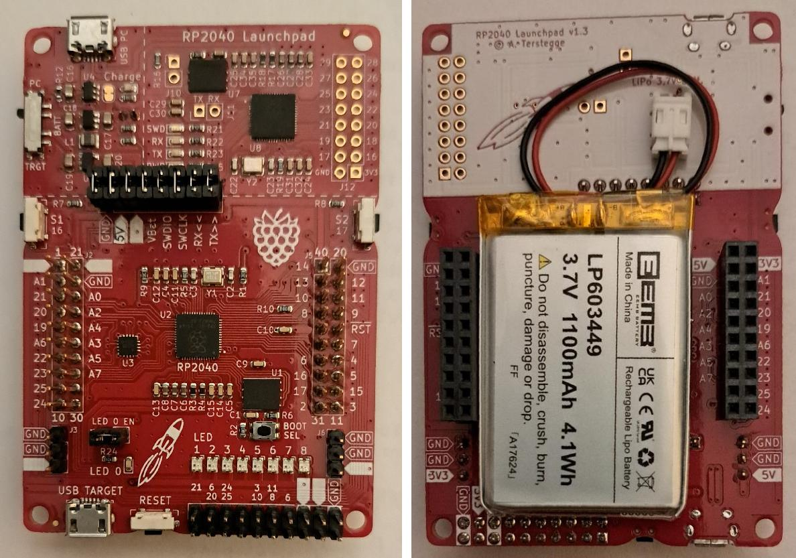

# RP2040-Launchpad PCB

This repository contains the KiCad design files for a TI-style Launchpad board
with the RP2040 microcontroller. The board features a build-in picoprobe
debugger, which signals UART RX/TX and SWD activity with 3 LEDs. The unused
GPIO pins of the picoprobe are connected to a header, which could be used
in the future for more functionality like a simple logic analyzer etc.

The target RP2040 controller has 2 connected pushbuttons, one normal LED and
8 WS2812-2020 LEDs as input/output. Some signals are also available on a
horizonal header at the lower end of the PCB, which is used to connect WLAN or
Bluetooth boards like WifiTick. Both RP2040 (target and picoprobe) use a
4 MiB flash chip. The target RP2040 also has a button to enable programming
via the target USB port (mass storage device). Normally this button is
not needed, because all programming and debugging of the target is performed
via the picoprobe using openocd and gdb.

The board also contains a LiPo-charger to enable battery-powered projects.

Why was this board designed? I have been using the MSP432 Launchpad from TI for
quite a while in university classes teaching microcontroller technology.
Unfortunately TI has stopped producing all MSP432-related products. Still we
have purchased lots of TI boosterpack-boards like the Educational Boosterpack MK II.
The be able to used these Boosterpacks also in the future, a new Launchpad had
to be found. The RP2040 is a very interesting microcontroller, and, what is
quite important for educational purposes, it has excellent documentation.
So some days were spent and this board came to life.

The pictures below show version 1.3. The board features 2 user buttons and
a reset button on the lower edge. Additionally there is one
user-programmable simple red LED and a row of 8 WS2812 LEDS.
 

